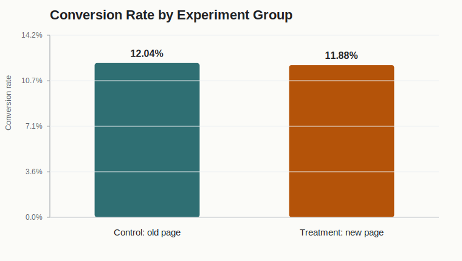
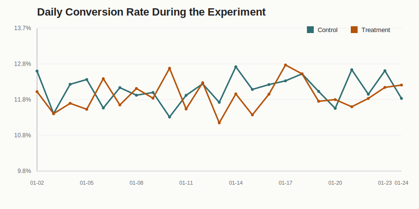

# A/B Test Analysis: Should an E-commerce Company Launch the New Landing Page?

## 1. Business Problem

An e-commerce company tested a new landing page against the existing page. The business question is:

> Does the new landing page improve user conversion enough to justify a full rollout?

The primary metric is **conversion rate**, defined as the share of users who completed the target action.

## 2. Dataset

Source: public landing-page A/B testing dataset from GitHub.

Raw data contains **294,478 rows** and five columns:

| Column | Description |
|---|---|
| `user_id` | Unique user identifier |
| `timestamp` | Time of exposure |
| `group` | Experiment group: control or treatment |
| `landing_page` | Page shown to the user: old page or new page |
| `converted` | Binary conversion indicator |

The experiment ran from **2017-01-02** to **2017-01-24**.

## 3. Data Quality Checks

Before estimating the treatment effect, I checked whether users were assigned consistently:

- Control users should see the old page.
- Treatment users should see the new page.
- Each user should appear once in the cleaned experiment table.

Cleaning result:

| Metric | Value |
|---|---:|
| Raw rows | 294,478 |
| Clean user-level rows | 290,584 |
| Removed invalid or duplicate rows | 3,894 |

Rows were removed when the group-page assignment was inconsistent or when a duplicate user appeared after assignment filtering.

## 4. Methodology

Hypotheses:

- **Null hypothesis H0:** the new landing page has the same conversion rate as the old page.
- **Alternative hypothesis H1:** the new landing page has a different conversion rate from the old page.

I used a two-proportion z-test at a 5% significance level.

The estimated treatment effect is:

```text
Treatment effect = Conversion rate (new page) - Conversion rate (old page)
```

## 5. Results



| Group | Users | Conversions | Conversion Rate |
|---|---:|---:|---:|
| Control: old page | 145,274 | 17,489 | 12.04% |
| Treatment: new page | 145,310 | 17,264 | 11.88% |

Estimated effect:

| Metric | Value |
|---|---:|
| Absolute lift | -0.158 percentage points |
| Relative lift | -1.31% |
| z-score | -1.311 |
| p-value | 0.190 |
| 95% confidence interval | [-0.394 pp, +0.078 pp] |



## 6. Interpretation

The treatment group converted at **11.88%**, while the control group converted at **12.04%**.

The observed difference is negative, but the p-value is **0.190**, which is above the 5% significance threshold. The 95% confidence interval also includes zero.

This means the test does not provide enough statistical evidence that the new landing page improves conversion. Based on this experiment, the company should not roll out the new page as a conversion-improving variant.

## 7. Recommendation

**Do not launch the new landing page as-is.**

Recommended next steps:

1. Keep the old landing page as the default experience.
2. Review the new page design and identify likely friction points.
3. Run qualitative checks or funnel diagnostics before testing another variant.
4. If the business still wants to continue testing, define a minimum detectable effect before the next experiment and calculate the required sample size upfront.

## 8. Tools Used

- Python
- pandas
- Manual two-proportion z-test implementation
- SVG visualizations generated from the analysis script

